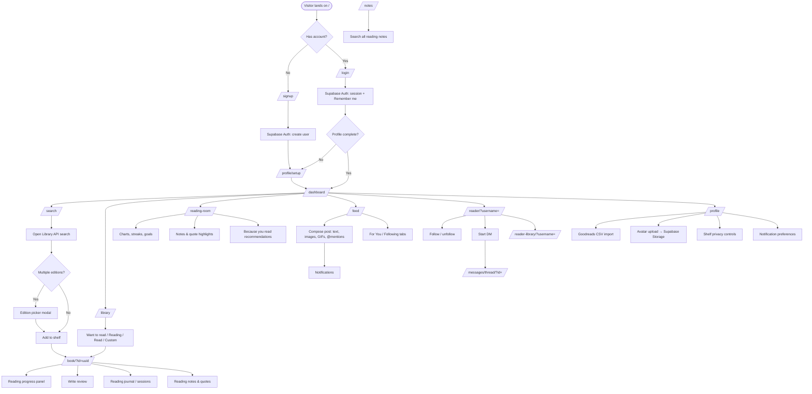
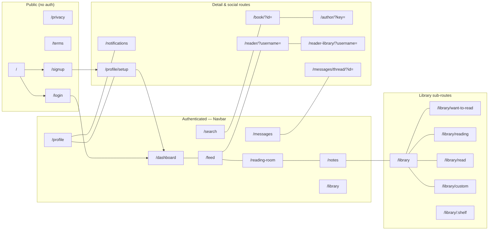
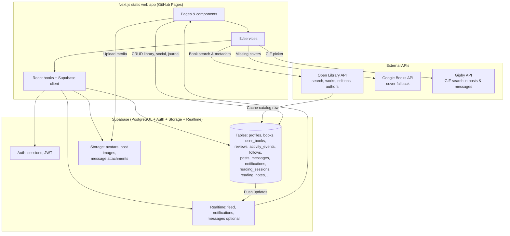

# Bookmarked — Complete Feature Documentation

**Product:** Bookmarked — web-first digital home library and social reading platform  
**Live URL:** https://bookmarked.online  
**Repository:** Bookmarked monorepo (`apps/web`, `apps/mobile`, `supabase/`, `docs/`)  
**Document date:** July 6, 2026  
**Total commits:** 104 (May 2026 → July 2026)

---

## Executive Summary

Bookmarked is a **web-first reading platform** where users search books, organize personal libraries on interactive shelves, track reading progress with journals and notes, write reviews, discover other readers, and participate in a social feed with posts, likes, comments, reposts, direct messages, and group chats.

The product ships as a **Next.js static export** deployed to **GitHub Pages** at the custom domain **bookmarked.online**, with **Supabase** providing authentication, PostgreSQL data, Row Level Security, file storage, and realtime subscriptions. Book metadata comes primarily from the **Open Library API**, with Google Books cover fallback and **Giphy** for GIF attachments in posts and messages.

**Phases completed:**

| Phase | Scope | Status |
|-------|--------|--------|
| Phase 0 | Planning, schema, infra | ✅ Complete |
| Phase 1 | Core web MVP (auth, search, shelves, progress, reviews, dashboard) | ✅ Complete |
| Phase 2 | Public pages, polish, production launch | ✅ Complete |
| Beyond plan | Social feed, messaging, posts, author pages, reading journal, notes, import | ✅ Shipped |
| Phase 3 | Mobile app foundation (`apps/mobile` scaffold) | 🟡 Ready to start |

The web application is **production-ready** and continuously extended. Mobile (React Native + Expo) is planned to reuse the same Supabase backend.

---

## Technology Stack

| Layer | Technology |
|-------|------------|
| Frontend | Next.js, TypeScript, Tailwind CSS |
| Backend | Supabase (PostgreSQL, Auth, RLS, Storage, Realtime) |
| Book data | Open Library API, Google Books (cover fallback) |
| GIFs | Giphy API (`NEXT_PUBLIC_GIPHY_API_KEY`) |
| Deployment | GitHub Actions → GitHub Pages → bookmarked.online |
| DNS | GoDaddy (GitHub Pages A records + www CNAME) |
| Mobile (future) | React Native + Expo (`apps/mobile`) |

---

## Feature Catalog by Area

### Authentication & Sessions

| What it does | Key routes / components | Shipped (approx.) |
|--------------|-------------------------|-------------------|
| Email signup and login via Supabase Auth | `/signup`, `/login` | Jun 2026 |
| Protected app routes with client auth guard | `ClientAuthGuard`, `(app)/layout` | Jun 2026 |
| Session persistence | Remember me on login/signup | Jun 26, 2026 |
| Logout | Navbar / profile actions | Jun 2026 |

**Notes:** Static export means all auth runs client-side; no server actions at runtime.

---

### Profiles & Onboarding

| What it does | Key routes / components | Shipped (approx.) |
|--------------|-------------------------|-------------------|
| First-time profile setup (username, display name, genres) | `/profile/setup` | Jun 2026 |
| Profile view and edit | `/profile` | Jun 2026 |
| Avatar upload | Supabase Storage (`013_avatar_storage`) | Jun 29, 2026 |
| Favorite genres, bio, display name | `profiles` table | Jun 2026 |
| Preferred library view (bookshelf vs grid) | `profiles.preferred_library_view` | Jun 2026 |
| Yearly reading goal with progress | `004_yearly_reading_goal` | Jun 8, 2026 |
| Preferred language (Open Library search default) | `20260630030000_preferred_language` | Jun 29, 2026 |
| Goodreads CSV library import | Profile import UI | Jul 6, 2026 |
| Granular notification preferences | `20260630050000_granular_notification_preferences` | Jun 29, 2026 |
| Profile feed & notifications previews | `/profile` sections | Jun 29, 2026 |

---

### Dashboard

| What it does | Key routes / components | Shipped (approx.) |
|--------------|-------------------------|-------------------|
| Welcome, quick actions, continue reading | `/dashboard` | Jun 2026 |
| Activity feed (own + social events) | `ActivityFeed` | Jun 2026 |
| Reading overview, streaks, favorite genre analytics | Dashboard widgets | Jun 8, 2026 |
| Reading activity charts | Charts component | Jul 6, 2026 |
| Because you read recommendations | Discovery section | Jul 6, 2026 |

---

### Book Search & Catalog

| What it does | Key routes / components | Shipped (approx.) |
|--------------|-------------------------|-------------------|
| Open Library title/keyword search | `/search` | Jun 2026 |
| Search filters, ISBN lookup | Search filters UI | Jun 29, 2026 |
| Paginated edition picker (load more) | Edition picker modal | Jun 29, 2026 |
| Add to shelf from search (hover actions, shelf picker, toasts) | `BookShelfActions`, `ShelfSelectMenu` | Jun 2026 |
| Book metadata enrichment from Open Library | `lib/services` | Jun 26, 2026 |
| Edition-specific covers when adding from search | ISBN-aware resolution | Jun 29, 2026 |
| Background stale catalog metadata refresh on library load | Library service | Jul 6, 2026 |
| Cache search results in `books` catalog table | `001_phase0_schema` | Jun 2026 |

**Cover fallback order:** Open Library cover ID → Open Library ISBN URL → Google Books → branded Bookmarked placeholder.

---

### Book Details

| What it does | Key routes / components | Shipped (approx.) |
|--------------|-------------------------|-------------------|
| Static-safe book page (GitHub Pages) | `/book/?id={uuid}` | Jun 14, 2026 |
| Metadata display (title, author, description, ISBN, pages) | `BookDetailsPage` | Jun 2026 |
| Shelf actions (want to read / reading / read) | `BookShelfActions` | Jun 2026 |
| Reading progress panel | `ReadingProgressPanel` | Jun 2026 |
| Reviews and ratings | `BookReviewSection` | Jun 2026 |
| Reading Journal button + deep-link scroll | Book page anchor | Jul 2, 2026 |
| Shareable book links | URL with query id | Jun 29, 2026 |
| Link to author page | `/author/?key=` | Jun 29, 2026 |

---

### Library & Shelves

| What it does | Key routes / components | Shipped (approx.) |
|--------------|-------------------------|-------------------|
| Full library with bookshelf and grid views | `/library`, `LibraryViewShell` | Jun 2026 |
| Default shelves: want to read, currently reading, read | `/library/want-to-read`, `/library/reading`, `/library/read` | Jun 2026 |
| Per-shelf analytics and sorting | `ShelfPageClient` | Jun 8, 2026 |
| Interactive bookshelf spines with full cover art | Bookshelf view | Jun 26, 2026 |
| Custom user-created shelves with optional genre labels | `/library/custom`, `user_shelves` | Jun 29, 2026 |
| Custom shelf deletion | Custom shelf UI | Jun 29, 2026 |
| Suggested shelves (genre-based, match preview tabs) | Reading Room / search flows | Jun 29, 2026 |
| Per-shelf privacy (public / followers / private) | `ShelfPrivacyPanel`, migration `007` | Jun 19, 2026 |
| Live shelf updates without full page reload | Realtime / optimistic UI | Jun 29, 2026 |

---

### Reading Room (Signature Feature)

| What it does | Key routes / components | Shipped (approx.) |
|--------------|-------------------------|-------------------|
| Personalized reading space | `/reading-room` | Jun 2026 (refined ongoing) |
| Shelf analytics, reading goal, streaks | Reading Room panels | Jun 2026 |
| Suggested shelf previews | Suggested shelves UI | Jun 29, 2026 |
| Reading notes and quote highlights timeline | Reading Room notes | Jul 6, 2026 |
| Reading activity charts | Charts | Jul 6, 2026 |
| Because you read recommendations | Discovery | Jul 6, 2026 |

---

### Reading Progress, Journal & Sessions

| What it does | Key routes / components | Shipped (approx.) |
|--------------|-------------------------|-------------------|
| Page and percent progress tracking | `user_books` columns | Jun 2026 |
| Start/finish dates, mark as finished | Progress panel | Jun 2026 |
| Reading sessions (`reading_sessions` table) | Journal UI on book page | Jul 2, 2026 |
| Per-session journal notes | Session notes | Jul 6, 2026 |
| Backfill reading sessions from existing progress | Migration / service | Jul 6, 2026 |
| Reading Journal deep links from book details | Book page | Jul 2, 2026 |

---

### Reading Notes

| What it does | Key routes / components | Shipped (approx.) |
|--------------|-------------------------|-------------------|
| Quote highlights and reading notes per book | `reading_notes` table | Jul 6, 2026 |
| Notes on profile and public reader pages | Profile / reader sections | Jul 6, 2026 |
| Global notes search | `/notes` | Jul 6, 2026 |
| Shared timeline and quote styles | UI polish | Jul 6, 2026 |

---

### Reviews & Ratings

| What it does | Key routes / components | Shipped (approx.) |
|--------------|-------------------------|-------------------|
| 1–5 star ratings, review text, spoiler flag | `reviews` table | Jun 2026 |
| Edit and delete own reviews | `BookReviewSection` | Jun 2026 |
| One review per user per book | `003_book_metadata_and_reviews_unique` | Jun 2026 |
| Review/message editing in conversations | Messaging polish | Jun 29, 2026 |
| Review comment reactions and replies | `20260630020000_review_comment_reactions_replies` | Jun 29, 2026 |

---

### Author Pages

| What it does | Key routes / components | Shipped (approx.) |
|--------------|-------------------------|-------------------|
| Author profile from Open Library key | `/author/?key=` | Jun 29, 2026 |
| Open Library discovery section on author pages | Author discovery | Jun 29, 2026 |
| Metadata refresh from Open Library | Catalog sync | Jun 29, 2026 |

---

### Social Feed & Posts

| What it does | Key routes / components | Shipped (approx.) |
|--------------|-------------------------|-------------------|
| For You and Following feeds | `/feed` | Jun 18, 2026 |
| Activity events (shelf changes, reviews, etc.) | `activity_events` | Jun 2026 |
| Activity visibility (public / followers / private) | Migration `005` | Jun 18, 2026 |
| Feed search (readers, books, posts) | Feed search bar | Jun 19, 2026 |
| Social posts with likes, comments, reposts | `posts`, `post_likes`, `post_comments` | Jun 29, 2026 |
| Post images (Supabase Storage) | `20260630010000_post_images_storage` | Jun 29, 2026 |
| GIF attachments in posts | Giphy picker | Jun 29, 2026 |
| Post drafts with autosave | `post_drafts` | Jun 29, 2026 |
| @mentions with notifications | Mention parser + links | Jun 29, 2026 |
| Comment attachments and quote reposts | Post engagement | Jun 29, 2026 |
| Edit own posts and quote reposts | Post owner actions | Jun 29, 2026 |
| Profile composer for posts | `/profile` | Jun 29, 2026 |
| Feed realtime updates | Realtime subscription | Jun 29, 2026 |
| Public posts section on reader profiles | `/reader` | Jul 6, 2026 |

---

### Follow Graph & Public Profiles

| What it does | Key routes / components | Shipped (approx.) |
|--------------|-------------------------|-------------------|
| Follow / unfollow readers | `follows` table | Jun 18, 2026 |
| Public reader profile (case-insensitive username) | `/reader/?username=` | Jun 18, 2026 |
| Follower / following counts and lists with mutuals | `FollowListModal` | Jun 19, 2026 |
| Profile shelf preview (3 shelves × 4 books) | Profile / reader | Jun 19, 2026 |
| Full public reader library | `/reader-library/?username=` | Jun 19, 2026 |
| Message button on other readers' profiles | Reader profile CTA | Jun 26, 2026 |
| Reading notes on reader profiles | Reader page | Jul 6, 2026 |

---

### Messaging

| What it does | Key routes / components | Shipped (approx.) |
|--------------|-------------------------|-------------------|
| Direct messages | `/messages`, `/messages/thread/?id=` | Jun 26, 2026 |
| Group conversations | New message modal | Jun 26, 2026 |
| Soft-delete own messages | `messages.deleted_at` | Jun 26, 2026 |
| Conversation pinning (3 per user) | `011_conversation_pins` | Jun 26, 2026 |
| Image attachments in messages | `20260629235453_message_attachments` | Jun 29, 2026 |
| GIF attachments in messages | GifSearchPicker | Jun 29, 2026 |
| Unread nav badge | `MessagesUnreadBadge` | Jul 6, 2026 |
| Group member management | `20260706120100_group_member_management` | Jul 6, 2026 |
| RLS participant scoping | Migrations `009`, `010` | Jun 26, 2026 |

---

### Notifications

| What it does | Key routes / components | Shipped (approx.) |
|--------------|-------------------------|-------------------|
| In-app notifications | `/notifications`, `notifications` table | Jun 26, 2026 |
| Browser toast alerts | Client notification service | Jun 26, 2026 |
| Notification deduplication | `20260629235300_notification_dedup` | Jun 29, 2026 |
| Granular preferences by activity type | Profile settings | Jun 29, 2026 |
| Triggers: follows, mentions, likes, comments, messages | DB + client | Jun–Jul 2026 |

---

### Public Marketing & Legal

| What it does | Key routes | Shipped (approx.) |
|--------------|------------|-------------------|
| Landing page (hero, about, features, contact) | `/` | Jun 2026 |
| Privacy policy | `/privacy` | Jun 26, 2026 |
| Terms of service | `/terms` | Jun 26, 2026 |
| Contact CTAs (mailto general@bookmarked.online) | Landing `#contact` | Jun 26, 2026 |
| Responsive mobile-first marketing layout | Landing sections | Jun 26, 2026 |

---

### Analytics & Discovery

| What it does | Key routes / components | Shipped (approx.) |
|--------------|-------------------------|-------------------|
| Per-shelf stats | Shelf pages | Jun 2026 |
| Favorite genre analytics | Dashboard / Reading Room | Jun 8, 2026 |
| Reading streak tracking | Analytics widgets | Jun 8, 2026 |
| Yearly reading goal progress | Profile + dashboard | Jun 8, 2026 |
| Reading activity charts | Dashboard + Reading Room | Jul 6, 2026 |
| Because you read recommendations | Discovery engine | Jul 6, 2026 |

---

### Accessibility & Responsive Design

| What it does | Shipped (approx.) |
|--------------|-------------------|
| Mobile-first responsive layouts across all pages | Jun 9, 2026 |
| Keyboard navigation, skip links, focus-visible | Jun 9, 2026 |
| Semantic HTML, accessible forms | Jun 9, 2026 |
| Static export navbar fixes (messages, hamburger) | Jun 26, 2026 |
| Graceful network fetch failure handling | Jul 2, 2026 |

---

## Route Reference (Complete)

### Public routes

| Route | Purpose |
|-------|---------|
| `/` | Landing page |
| `/login` | Login |
| `/signup` | Signup |
| `/privacy` | Privacy policy |
| `/terms` | Terms of service |

### Authenticated app routes (navbar)

| Route | Purpose |
|-------|---------|
| `/dashboard` | Home, continue reading, analytics, activity |
| `/feed` | Social feed (For You / Following), post composer |
| `/reading-room` | Signature personalized reading space |
| `/notes` | Global reading notes search |
| `/library` | Full library (bookshelf / grid toggle) |
| `/library/want-to-read` | Want to read shelf |
| `/library/reading` | Currently reading shelf |
| `/library/read` | Read shelf |
| `/library/custom` | Custom shelves management |
| `/library/[shelf]` | Dynamic shelf pages |
| `/search` | Open Library book search |
| `/messages` | Inbox (direct + group) |
| `/messages/thread/?id=` | Conversation thread |
| `/profile` | Own profile, settings, import |
| `/profile/setup` | Onboarding |
| `/notifications` | Notification center |

### Detail & social routes

| Route | Purpose |
|-------|---------|
| `/book/?id={uuid}` | Book details, progress, reviews, journal |
| `/author/?key={ol_key}` | Author page + Open Library discovery |
| `/reader/?username={name}` | Public reader profile |
| `/reader-library/?username={name}` | Public full library view |

---

## Database & Backend Highlights

### Core tables (migration `001_phase0_schema`)

| Table | Purpose |
|-------|---------|
| `profiles` | User profile data linked to `auth.users` |
| `books` | Cached catalog (Open Library external ids) |
| `user_books` | User's books on shelves with progress |
| `reviews` | Ratings and review text |
| `activity_events` | Feed activity log |

### Incremental migrations (chronological)

| Migration | Purpose |
|-----------|---------|
| `002_preferred_library_view` | Bookshelf vs grid preference |
| `003_book_metadata_and_reviews_unique` | Richer book metadata; one review per user/book |
| `004_yearly_reading_goal` | Yearly reading target on profile |
| `005_social_follows_and_feed` | `follows`; activity visibility |
| `006_profiles_fk_for_embeds` | PostgREST profile embeds |
| `007_shelf_visibility` | Per-shelf public/followers/private + RLS |
| `008_books_catalog_update` | Catalog update policies |
| `009_messaging` | Conversations, participants, messages |
| `010_messaging_rls_creator_access` | Creator can start DMs |
| `011_conversation_pins` | Pin up to 3 conversations |
| `012_notifications` | In-app notifications |
| `013_avatar_storage` | Avatar upload bucket + policies |
| `20260629222724_custom_shelves` | `user_shelves`, `user_shelf_books` |
| `20260629225003_fix_custom_shelves_rls` | Custom shelf RLS fix |
| `20260629234631_social_posts` | Posts, likes, comments |
| `20260629235242_notification_dedup` | Dedup notifications |
| `20260629235453_message_attachments` | Message image attachments |
| `20260630010000_post_images_storage` | Post image storage |
| `20260630020000_review_comment_reactions_replies` | Review/post comment engagement |
| `20260630030000_preferred_language` | Profile language preference |
| `20260630030100_posts_realtime` | Realtime for posts |
| `20260630030200_fix_posts_rls_recursion` | Fix posts RLS infinite recursion |
| `20260630030300_post_drafts` | Post draft autosave |
| `20260630030400_comment_attachments` | Comment file attachments |
| `20260630040000_post_comment_attachments` | Post comment attachments |
| `20260630050000_granular_notification_preferences` | Per-type notification prefs |
| `20260702000000_reading_sessions` | Reading session journal |
| `20260706120000_reading_sessions_update_note` | Session note updates |
| `20260706120100_group_member_management` | Group chat member admin |
| `20260706220000_reading_notes` | Reading notes and quotes |

### Supabase services used

- **Auth** — email/password, session JWT, client-side guard
- **PostgreSQL + RLS** — all tables secured per-user
- **Storage** — avatars, post images, message attachments
- **Realtime** — feed posts, notifications (optional messaging)

### External API integration

| API | Usage |
|-----|-------|
| Open Library | Search, works/editions, authors, covers, metadata refresh |
| Google Books | Cover fallback when Open Library has no art |
| Giphy | GIF search in posts, comments, messages, reposts |

---

## Chronological Development Timeline

### May 2026 — Project inception

- **May 2** — Initial commit; mobile foundation with Supabase auth scaffold

### June 2026 — Web platform MVP

- **Jun 2** — Web-first Next.js app, Supabase integration, docs structure
- **Jun 2** — Interactive bookshelf views, Reading Room, shelf analytics
- **Jun 8** — Phase 1 MVP + Phase 1.5 (shelf sorting, mark-finished, yearly goal, genre analytics, streaks)
- **Jun 9** — Responsive design & accessibility sprint; GitHub Pages deployment configured
- **Jun 9** — Supabase env injection fixes for static builds
- **Jun 14** — Book details static route fix for GitHub Pages; cover improvements
- **Jun 18** — Phase 1 completion sprint closed; social follows + dual feed
- **Jun 19** — Feed search, follower lists, shelf privacy, public shelf previews
- **Jun 26** — Phase 2 public pages complete; messaging MVP; notifications; navbar/static export fixes
- **Jun 26** — Metadata enrichment, Remember me, bookshelf spine redesign, contact email
- **Jun 29** — Custom shelves, avatar uploads, advanced search (filters, ISBN, editions)
- **Jun 29** — Social posts (likes, comments, reposts), message attachments, author pages
- **Jun 29** — Post drafts, @mentions, GIF picker, realtime feed, notification preferences

### July 2026 — Reading journal & notes sprint

- **Jul 2** — Reading sessions & journal; deploy workflow hardening; network error handling
- **Jul 6** — Reading notes, activity charts, Goodreads import, group chat polish
- **Jul 6** — Global `/notes` search, public posts on profiles, catalog metadata refresh

---

## Deployment Information

### Hosting architecture

```
Git push to main
    → GitHub Actions (.github/workflows/deploy.yml)
    → npm install + validate-env (Supabase + Giphy secrets)
    → Next.js static export (apps/web/out/)
    → upload-pages-artifact
    → deploy-pages@v4 → GitHub Pages
    → bookmarked.online (GoDaddy DNS)
```

### Required GitHub Actions secrets

| Secret | Purpose |
|--------|---------|
| `NEXT_PUBLIC_SUPABASE_URL` | Supabase project URL (baked at build) |
| `NEXT_PUBLIC_SUPABASE_ANON_KEY` | Supabase anon key (baked at build) |
| `NEXT_PUBLIC_GIPHY_API_KEY` | Giphy API for GIF search |

### DNS (GoDaddy)

- **A records:** `185.199.108.153`, `185.199.109.153`, `185.199.110.153`, `185.199.111.153`
- **CNAME `www`:** `DekuWorks.github.io`
- **HTTPS:** Enforced after DNS propagation via GitHub Pages

### Static export constraints

- Query-based routes: `/book/?id=`, `/reader/?username=`, `/messages/thread/?id=`, `/author/?key=`
- `public/.nojekyll` prevents Jekyll processing
- Full-page navigation on static export (no client-side router-only nav for some flows)
- All data access client-side via Supabase JS client

### Local development

```bash
cd apps/web
cp .env.local.example .env.local
# Set NEXT_PUBLIC_SUPABASE_URL, NEXT_PUBLIC_SUPABASE_ANON_KEY, NEXT_PUBLIC_GIPHY_API_KEY
npm install
npm run dev
```

Open http://localhost:3000

---

## Architecture Flowcharts

### User Journey: Signup → Profile → Library → Reading → Social



### App Navigation Map



### Data Flow: Open Library, Supabase, Giphy



> **Standalone flowchart file:** [Bookmarked_WebApp_Flowchart.md](./Bookmarked_WebApp_Flowchart.md)

---

## Deferred / Future Work

| Item | Status |
|------|--------|
| Mobile app (Expo) auth + navigation parity | Not started (`apps/mobile` scaffold) |
| Mobile shelves, search, progress, reviews | Phase 4 — not started |
| Cross-platform sync testing | Phase 5 — partial |
| App store readiness | Not started |
| Book clubs | Deferred |
| Badges & achievements | Deferred |
| ISBNdb metadata integration | Planned |
| Drag-and-drop shelf animations | Planned polish |

---

## Related Documentation

| Document | Path |
|----------|------|
| Project overview | `docs/project/PROJECT_OVERVIEW.md` |
| Master task list | `docs/project/MASTER_TASK_LIST.md` |
| Progress tracker | `docs/progress/PROGRESS_TRACKER.md` |
| Architecture context | `docs/architecture/ARCHITECTURE_CONTEXT.md` |
| Design system | `docs/ui/DESIGN_SYSTEM.md` |
| Web app flowcharts | `docs/Bookmarked_WebApp_Flowchart.md` |

---

*Bookmarked — Complete feature documentation. Generated July 6, 2026.*
