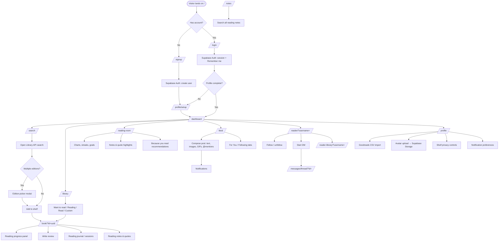
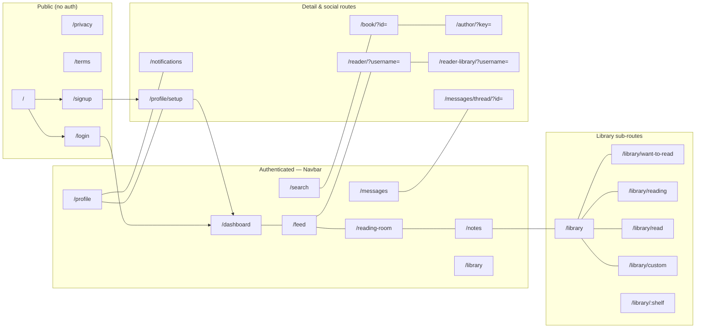
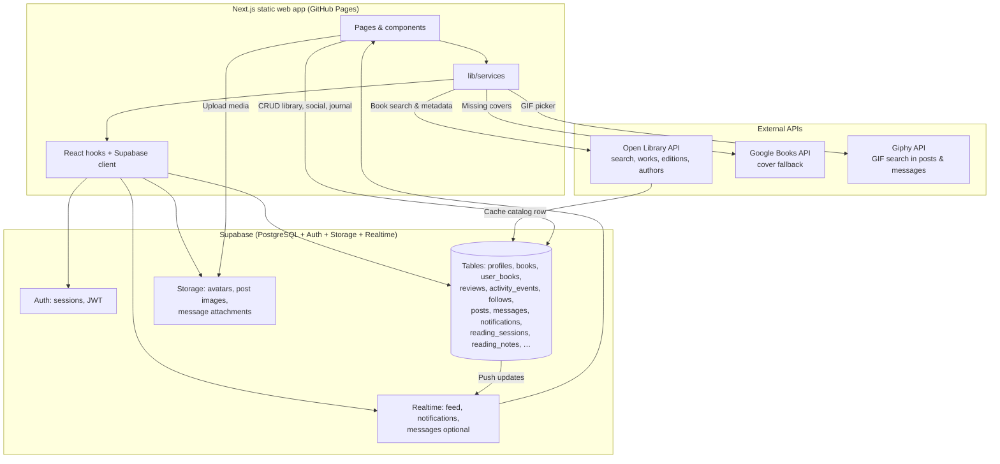
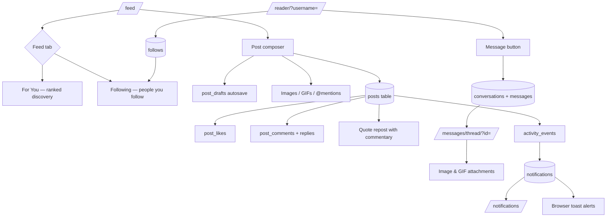

# Bookmarked — Web App Flowcharts

Standalone architecture and user-flow diagrams for the Bookmarked web application.  
**Live:** https://bookmarked.online

---

## 1. User Journey (Signup → Social)



---

## 2. App Navigation Map (Main Routes)



---

## 3. Data Flow (Open Library, Supabase, Giphy)



---

## 4. Reading & Journal Flow

```mermaid
flowchart TD
    Book[/book/?id=/] --> OnShelf{On a shelf?}
    OnShelf -->|Add| ShelfPick[Want to read / Reading / Read]
    ShelfPick --> StartRead[Mark started → currently_reading]
    StartRead --> Sessions[reading_sessions table]
    Sessions --> SessionNote[Per-session journal note]
    StartRead --> Progress[pages / percent progress]
    Progress --> Finish[Mark finished → read shelf]
    Finish --> Review[reviews table + activity_events]

    Book --> ReadingNotes[reading_notes: quotes & highlights]
    ReadingNotes --> NotesPage[/notes/ global search]
    ReadingNotes --> ProfileNotes[Profile & reader pages]
    ReadingNotes --> RoomNotes[Reading Room timeline]

    Dashboard --> Charts[Activity charts]
    ReadingRoom --> Charts
    Charts --> Sessions
```

---

## 5. Social & Messaging Flow



---

*Generated July 2026 — aligned with production at https://bookmarked.online*
